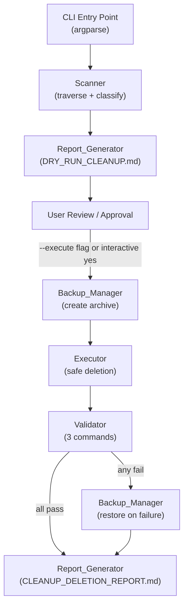

# Design Document: Project Cleanup Tool

## Overview

The Project Cleanup Tool is a single-file Python CLI utility (`cleanup_tool.py`) placed at the project root. It performs a safe, two-phase workflow:

1. **Dry-run phase** (default): Recursively scans the repository, classifies files against deletion patterns and protected-path rules, and writes a human-readable Markdown report (`DRY_RUN_CLEANUP.md`) without touching any file.
2. **Execute phase** (opt-in): After the user reviews the report and explicitly approves, creates a compressed backup, deletes files in a defined safe order, runs three post-deletion validation commands, and writes a final audit report (`CLEANUP_DELETION_REPORT.md`). If any validation fails, the backup is automatically restored.

The tool targets a Python/FastAPI + React/TypeScript project with the following protected top-level directories: `src/`, `tests/`, `examples/`, `kaggle_demo/`, `frontend/`, `docs/`, `outputs/`, `venv/`, `.venv/`.

### Design Goals

- **Safety first**: Protected-path enforcement is applied independently at both the Scanner and Executor stages so a single bug cannot cause accidental deletion of critical files.
- **Transparency**: Every decision (skip, flag, delete) is logged and reported.
- **Recoverability**: A compressed backup is always created before any deletion; validation failure triggers automatic restore.
- **Simplicity**: A single self-contained script with no third-party runtime dependencies (only stdlib).

---

## Architecture

The tool is structured as five cooperating components inside a single Python module. Data flows linearly through the pipeline:



### Two-Mode Operation

| Mode | Trigger | Side Effects |
|------|---------|--------------|
| Dry-run | Default (no flag) | Writes `DRY_RUN_CLEANUP.md` only |
| Execute | `--execute` flag + confirmation | Creates backup, deletes files, writes `CLEANUP_DELETION_REPORT.md` |

---

## Components and Interfaces

### 5.1 Scanner

Responsible for recursive directory traversal and file classification.

```python
class Scanner:
    def __init__(self, root: Path, protected_paths: ProtectedPathConfig): ...
    def scan(self) -> ScanResult: ...
    def _classify_file(self, path: Path) -> Optional[CandidateFile]: ...
    def _is_protected(self, path: Path) -> bool: ...
    def _is_orphaned_script(self, path: Path, all_py_files: List[Path]) -> bool: ...
    def _check_import_references(self, module_name: str, all_py_files: List[Path]) -> bool: ...
    def _has_main_guard(self, path: Path) -> bool: ...
```

**Key behaviors:**
- Traversal uses `os.walk()` with directory pruning: when a directory is identified as a deletion candidate (e.g., `__pycache__`), it is added to the candidate list and its subtree is skipped (no need to recurse into it).
- Protected-path check is applied before pattern matching — if a path is protected, it is never classified as a candidate regardless of its name.
- Orphaned-script detection is a two-pass operation: first collect all `.py` files, then evaluate each one.

### 5.2 Report_Generator

Produces structured Markdown reports from `ScanResult` or `ExecutionResult`.

```python
class ReportGenerator:
    def write_dry_run_report(self, result: ScanResult, output_path: Path) -> None: ...
    def write_final_report(self, result: ExecutionResult, output_path: Path) -> None: ...
    def _format_size(self, size_bytes: int) -> str: ...
    def _group_by_category(self, candidates: List[CandidateFile]) -> Dict[str, List[CandidateFile]]: ...
```

### 5.3 Backup_Manager

Creates and restores compressed archives of candidate files.

```python
class BackupManager:
    def __init__(self, root: Path, backup_dir: Path): ...
    def create_backup(self, candidates: List[CandidateFile]) -> BackupRecord: ...
    def restore(self, record: BackupRecord) -> RestoreResult: ...
```

**Backup strategy:**
- Archive format: `tarfile` with `gz` compression (stdlib, no dependencies).
- Archive name: `cleanup_backup_{timestamp}.tar.gz` stored in `{project_root}/.cleanup_backups/`.
- The `.cleanup_backups/` directory is added to the protected-path list at runtime so it is never itself a deletion target.
- Each archived file preserves its relative path so restoration is a simple extract-to-root operation.

### 5.4 Executor

Performs deletions in the defined safe order with per-file confirmation for medium-risk items.

```python
class Executor:
    def __init__(self, root: Path, protected_paths: ProtectedPathConfig): ...
    def execute(self, candidates: List[CandidateFile], interactive: bool) -> ExecutionResult: ...
    def _delete_item(self, candidate: CandidateFile) -> DeletionRecord: ...
    def _confirm_medium_risk(self, candidate: CandidateFile) -> bool: ...
    def _double_check_protected(self, path: Path) -> bool: ...
```

**Deletion order** (matches Requirement 7.2):
1. `__pycache__` dirs, `*.pyc`, `*.pyo`
2. `.DS_Store`, `Thumbs.db`, `desktop.ini`, `.directory`
3. `*.log`, `*.tmp`, `*.temp`, `*.bak`, `*.orig`, `*.rej`
4. `.pytest_cache`, `.mypy_cache`, `.coverage`, `htmlcov`
5. `build`, `dist`, `*.egg-info` dirs
6. `*.swp`, `*.swo`, `~$*` files

Medium-risk items (`*.txt` non-requirements, orphaned `.py` files) are **not** deleted automatically — they are listed in the report and require per-item interactive confirmation.

The Executor re-checks the protected-path rules immediately before each deletion as a second independent safety layer (Requirement 10.1).

### 5.5 Validator

Runs three post-deletion commands and triggers restore on failure.

```python
class Validator:
    def __init__(self, root: Path): ...
    def validate(self) -> ValidationResult: ...
    def _run_command(self, cmd: str) -> CommandResult: ...
```

**Validation commands:**
1. `python -c "import src.pipeline; print('Pipeline OK')"` — verifies core pipeline import
2. `python clean_voice.py --help` — verifies main entry point is intact
3. `pytest tests/ -v --ignore=tests/test_custom_modules.py` — runs test suite

---

## Data Models

All data structures are implemented as `dataclasses` for clarity and easy serialization.

```python
from dataclasses import dataclass, field
from pathlib import Path
from enum import Enum
from typing import List, Optional, Dict
import datetime

class RiskLevel(Enum):
    LOW = "low"
    MEDIUM = "medium"

class FileCategory(Enum):
    PYTHON_BYTECODE = "Python Bytecode"
    PYTHON_CACHE = "Python Cache Directory"
    COMPILED_EXTENSION = "Compiled Extension"
    LOG_FILE = "Log File"
    TEMP_FILE = "Temporary/Backup File"
    OS_METADATA = "OS Metadata"
    EDITOR_ARTIFACT = "Editor Artifact"
    TEST_CACHE = "Test/Type-Check Cache"
    COVERAGE_ARTIFACT = "Coverage Artifact"
    BUILD_ARTIFACT = "Build Artifact"
    PIP_CACHE = "Pip Cache"
    ORPHANED_SCRIPT = "Orphaned Script"
    PLAIN_TEXT = "Plain Text File"

@dataclass
class CandidateFile:
    path: Path                    # Absolute path
    relative_path: Path           # Relative to project root
    size_bytes: int               # 0 for directories (sum of contents)
    category: FileCategory
    risk_level: RiskLevel
    action: str                   # "DELETE" or "KEEP"
    is_directory: bool
    reason: Optional[str] = None  # Explanation for medium-risk items

@dataclass
class ScanResult:
    candidates: List[CandidateFile]
    protected_paths_encountered: List[Path]
    skipped_paths: List[Path]
    scan_timestamp: datetime.datetime
    root: Path

@dataclass
class BackupRecord:
    archive_path: Path
    created_at: datetime.datetime
    archived_files: List[Path]
    total_size_bytes: int

@dataclass
class DeletionRecord:
    path: Path
    success: bool
    error: Optional[str] = None
    skipped: bool = False
    skip_reason: Optional[str] = None

@dataclass
class CommandResult:
    command: str
    exit_code: int
    stdout: str
    stderr: str

@dataclass
class ValidationResult:
    passed: bool
    command_results: List[CommandResult]

@dataclass
class ExecutionResult:
    deletions: List[DeletionRecord]
    backup_record: BackupRecord
    validation_result: ValidationResult
    restored: bool
    execution_timestamp: datetime.datetime
    total_bytes_reclaimed: int

@dataclass
class ProtectedPathConfig:
    protected_dirs: List[str]          # e.g. ["src", "tests", "frontend", ...]
    protected_filenames: List[str]     # e.g. ["requirements.txt", ".gitignore", ...]
    protected_extensions: List[str]    # e.g. [".md", ".yaml", ".yml", ".json"]
    protected_exact_paths: List[Path]  # Absolute paths computed at startup
```

---

## CLI Interface

The tool uses `argparse` with the following interface:

```
usage: cleanup_tool.py [-h] [--execute] [--yes] [--backup-dir DIR] [--root DIR] [--verbose]

Project Cleanup Tool — safe maintenance utility for the voice-processing pipeline.

optional arguments:
  -h, --help          show this help message and exit
  --execute           Execute deletions after dry-run (requires confirmation)
  --yes               Skip interactive confirmation prompt (use with --execute)
  --backup-dir DIR    Directory to store backup archive (default: .cleanup_backups/)
  --root DIR          Project root directory (default: current working directory)
  --verbose           Print each file as it is scanned
```

**Execution flow:**

```
cleanup_tool.py              → dry-run only, writes DRY_RUN_CLEANUP.md
cleanup_tool.py --execute    → dry-run, prompt for approval, then execute
cleanup_tool.py --execute --yes  → dry-run, skip prompt, execute immediately
```

---

## File Traversal Algorithm

```
function scan(root, protected_config):
    all_py_files = collect_all_py_files(root, protected_config)
    candidates = []
    protected_encountered = []
    dirs_to_skip = set()

    for dirpath, dirnames, filenames in os.walk(root, topdown=True):
        # Prune protected directories from traversal
        dirnames[:] = [
            d for d in dirnames
            if not is_protected_dir(Path(dirpath) / d, protected_config)
        ]

        # Check if current directory itself is a candidate (e.g. __pycache__)
        current_dir = Path(dirpath)
        if current_dir != root:
            dir_candidate = classify_directory(current_dir, protected_config)
            if dir_candidate is not None:
                candidates.append(dir_candidate)
                dirnames[:] = []   # skip recursing into this directory
                continue

        for filename in filenames:
            filepath = Path(dirpath) / filename
            if is_protected(filepath, protected_config):
                protected_encountered.append(filepath)
                continue
            candidate = classify_file(filepath, all_py_files, protected_config)
            if candidate is not None:
                candidates.append(candidate)

    return ScanResult(candidates, protected_encountered, ...)
```

**Pattern matching priority** (first match wins):
1. Protected-path check → skip entirely
2. Directory name matches deletion pattern → add as directory candidate, prune subtree
3. File extension/name matches low-risk pattern → add as low-risk candidate
4. File is `*.txt` and not `requirements*.txt` → add as medium-risk candidate
5. File is `*.py` outside protected paths → run orphaned-script check

---

## Orphaned Script Detection Algorithm

Orphaned-script detection is a two-pass algorithm to avoid O(n²) repeated file reads:

**Pass 1 — Build import index:**
```
function build_import_index(all_py_files):
    imported_modules = set()
    for py_file in all_py_files:
        for line in read_lines(py_file):
            if line matches "import <module>" or "from <module> import ...":
                imported_modules.add(normalize_module_name(module))
    return imported_modules
```

**Pass 2 — Classify each candidate `.py` file:**
```
function is_orphaned(py_file, imported_modules):
    module_name = path_to_module_name(py_file)   # e.g. "utils/helper.py" → "utils.helper"
    if module_name in imported_modules:
        return False   # referenced somewhere
    if file_contains_main_guard(py_file):
        return False   # standalone runnable script
    return True        # orphaned
```

**Module name normalization:**
- Strip `.py` extension
- Replace `/` and `\` with `.`
- Also check the bare filename stem (e.g., `helper`) to catch `import helper` style imports

**`__main__` guard detection:**
- Read file lines and check for the pattern `if __name__` (handles `if __name__ == "__main__":` and `if __name__ == '__main__':`)

---

## Backup and Restore Strategy

### Backup Creation

```
function create_backup(candidates, backup_dir):
    timestamp = datetime.now().strftime("%Y%m%d_%H%M%S")
    archive_path = backup_dir / f"cleanup_backup_{timestamp}.tar.gz"
    backup_dir.mkdir(parents=True, exist_ok=True)

    with tarfile.open(archive_path, "w:gz") as tar:
        for candidate in candidates:
            if candidate.path.exists():
                tar.add(candidate.path, arcname=candidate.relative_path)

    return BackupRecord(archive_path, datetime.now(), ...)
```

### Restore

```
function restore(record, root):
    with tarfile.open(record.archive_path, "r:gz") as tar:
        tar.extractall(path=root)
    return RestoreResult(success=True, ...)
```

**Safety properties of the backup:**
- The `.cleanup_backups/` directory is added to `protected_exact_paths` at startup.
- Backup is created before the first deletion; if backup creation fails, the entire execute phase is aborted.
- Restore uses `extractall` which recreates the original directory structure.

---

## Validation and Error Handling

### Validation Command Execution

Each command is run via `subprocess.run()` with a 120-second timeout:

```python
result = subprocess.run(
    cmd,
    shell=True,
    capture_output=True,
    text=True,
    cwd=root,
    timeout=120
)
```

### Error Handling Matrix

| Situation | Behavior |
|-----------|----------|
| Backup creation fails | Abort execute phase, report error, no deletions |
| File missing at deletion time | Log warning, continue (Requirement 7.6) |
| Protected path detected at execution time | Skip, log warning, continue (Requirement 10.2) |
| Validation command fails | Trigger restore, write error report |
| Restore fails | Log critical error, preserve backup archive path for manual recovery |
| `os.walk` permission error | Log warning, skip inaccessible directory |
| File read error during orphan detection | Log warning, treat file as non-orphaned (safe default) |

### Logging

The tool uses Python's `logging` module with two handlers:
- **Console handler**: `INFO` level by default, `DEBUG` with `--verbose`
- **File handler**: `DEBUG` level, writes to `cleanup_tool.log` (which is itself a low-risk deletion candidate on the next run)

---

## Correctness Properties

*A property is a characteristic or behavior that should hold true across all valid executions of a system — essentially, a formal statement about what the system should do. Properties serve as the bridge between human-readable specifications and machine-verifiable correctness guarantees.*

Property-based testing is applicable here because the Scanner's classification logic and protected-path enforcement are pure functions over structured inputs. The input space (file paths, patterns, project structures) is large and varied, making randomized testing valuable for finding edge cases that example-based tests would miss.

The chosen PBT library is **Hypothesis** (Python), configured with `@settings(max_examples=100)` per property.

---

### Property 1: Protected paths are never classified as candidates

*For any* file path that falls under a protected directory (`src/`, `tests/`, `examples/`, `kaggle_demo/`, `frontend/`, `docs/`, `outputs/`, `venv/`, `.venv/`) or matches a protected filename/extension rule (`.md`, `.yaml`, `.yml`, `.json`, `requirements*.txt`, `.gitignore`, etc.), the Scanner SHALL return `None` (not a candidate) regardless of the file's name or extension — even if the filename matches a low-risk deletion pattern.

**Validates: Requirements 1.3, 4.1–4.16, 10.1**

---

### Property 2: Low-risk pattern classification is correct and mutually exclusive

*For any* file path whose name matches a low-risk deletion pattern (e.g., `*.pyc`, `*.log`, `__pycache__`, `.DS_Store`, `*.swp`) and does not reside under a protected path, the Scanner SHALL classify it with `RiskLevel.LOW` and the correct `FileCategory`. Furthermore, no file path shall appear in the candidate list more than once — each file is assigned to at most one category.

**Validates: Requirements 1.5, 2.1–2.19**

---

### Property 3: Orphaned script detection is correct in both directions

*For any* set of `.py` files outside protected paths: (a) if a given file has no import references in any other file AND contains no `if __name__ == "__main__"` guard, the Scanner SHALL classify it as `ORPHANED_SCRIPT` with `RiskLevel.MEDIUM`; (b) if a file IS referenced by at least one import statement OR contains a `__main__` guard, the Scanner SHALL NOT classify it as orphaned. This property holds for any combination of import styles (`import module`, `from module import ...`) and any file depth.

**Validates: Requirements 3.1–3.5**

---

### Property 4: Protected paths are never deleted by the Executor

*For any* `CandidateFile` whose path matches any protected-path rule — regardless of how the candidate was constructed (including simulating a Scanner bug that incorrectly added a protected path) — the Executor SHALL skip the deletion and record a `DeletionRecord` with `skipped=True`. The protected file SHALL remain on disk after execution completes.

**Validates: Requirements 10.1, 10.2, 10.3, 10.4**

---

### Property 5: Medium-risk items require explicit confirmation and are never auto-deleted

*For any* `CandidateFile` with `RiskLevel.MEDIUM` (orphaned scripts and non-requirements `.txt` files), the Executor SHALL NOT delete it without explicit per-item user confirmation. When confirmation is denied or unavailable (non-interactive mode), the file SHALL remain on disk and be recorded as skipped in the execution result.

**Validates: Requirements 7.3, 7.4, 10.5**

---

### Property 6: `requirements.txt` variants are never candidates

*For any* file whose name is `requirements.txt`, `requirements-dev.txt`, or `requirements-prod.txt`, regardless of its directory location (including directories that are not otherwise protected), the Scanner SHALL never add it to the candidate list.

**Validates: Requirements 2.17, 4.1**

---

### Property 7: Report content is complete and internally consistent

*For any* `ScanResult` or `ExecutionResult`, the generated report SHALL contain an entry for every candidate file with all required fields (relative path, size, action, risk level), and the summary totals (file count, total bytes) SHALL equal the arithmetic sum of the individual candidate entries. No candidate shall be silently omitted from the report.

**Validates: Requirements 5.2–5.5, 9.1–9.6**

---

### Property 8: Deletion order follows the defined safe sequence

*For any* set of `CandidateFile` objects spanning multiple deletion categories, the Executor SHALL process and delete them in the order defined by Requirement 7.2 (bytecode first, then OS metadata, then temp files, then test caches, then build artifacts, then editor artifacts). No item from a later category shall be deleted before all items from an earlier category have been processed.

**Validates: Requirements 7.1, 7.2**

---

## Testing Strategy

### Dual Testing Approach

Both unit/example-based tests and property-based tests are used:

- **Unit tests** cover specific examples, integration points, and error conditions (e.g., "scanning an empty directory returns an empty candidate list", "backup creation failure aborts execution").
- **Property tests** verify universal invariants across randomly generated inputs (see Correctness Properties above).

### Property-Based Testing with Hypothesis

The tool uses [Hypothesis](https://hypothesis.readthedocs.io/) for property-based testing. All property tests operate on in-memory `Path` objects and data structures — no real filesystem I/O — so they run fast and deterministically.

```python
# Example: Property 1 — Protected paths are never classified as candidates
from hypothesis import given, settings
from hypothesis import strategies as st
from pathlib import Path

PROTECTED_DIRS = ["src", "tests", "examples", "kaggle_demo",
                  "frontend", "docs", "outputs", "venv", ".venv"]

DELETION_PATTERNS = ["__pycache__", ".pytest_cache", ".mypy_cache",
                     "build", "dist", ".pip_cache"]

valid_filename = st.text(
    alphabet=st.characters(whitelist_categories=("Lu", "Ll", "Nd"), whitelist_characters="._-"),
    min_size=1, max_size=50
)

@given(
    protected_prefix=st.sampled_from(PROTECTED_DIRS),
    subpath=valid_filename,
    filename=st.sampled_from(["foo.pyc", "__pycache__", ".DS_Store", "foo.log", "foo.tmp"])
)
@settings(max_examples=100)
def test_protected_paths_never_candidates(protected_prefix, subpath, filename):
    # Feature: project-cleanup-tool, Property 1: Protected paths are never classified as candidates
    path = Path(protected_prefix) / subpath / filename
    scanner = Scanner(root=Path("."), protected_paths=DEFAULT_PROTECTED_CONFIG)
    result = scanner._classify_file(path)
    assert result is None
```

Each property test:
- Is tagged with a comment: `# Feature: project-cleanup-tool, Property N: <property_text>`
- Uses `@settings(max_examples=100)` minimum
- Tests pure classification/enforcement functions directly (no filesystem I/O)

### Property Test Summary

| Property | Test Focus | Key Generators |
|----------|-----------|----------------|
| 1 | Protected paths → never candidate | `protected_dir × deletion_pattern_filename` |
| 2 | Low-risk patterns → correct category, no duplicates | `low_risk_filename × non_protected_dir` |
| 3 | Orphan detection both directions | `py_file_set × import_statements × main_guard_presence` |
| 4 | Executor skips protected paths | `CandidateFile with protected path` |
| 5 | Medium-risk → confirmation required | `CandidateFile with RiskLevel.MEDIUM` |
| 6 | `requirements*.txt` → never candidate | `requirements_filename × any_dir` |
| 7 | Report totals match candidate data | `List[CandidateFile]` with random sizes/categories |
| 8 | Deletion order follows safe sequence | `CandidateFile list spanning all categories` |

### Unit Test Coverage

| Component | Key Test Cases |
|-----------|---------------|
| Scanner | Empty directory, all-protected directory, mixed directory, each pattern type individually |
| Orphan detector | File with imports, file with `__main__`, file with both, file with neither, `from x import y` style |
| Report_Generator | Empty candidate list, all risk levels present, size formatting (bytes/KB/MB), summary totals |
| Backup_Manager | Successful backup, backup failure (permission error), restore integrity, archive contains all candidates |
| Executor | Deletion order verification, medium-risk skip without confirmation, missing-file warning, directory recursive delete |
| Validator | All pass, first command fails, second command fails, third command fails, restore triggered on failure |

### Integration Tests

A small synthetic project tree (created in a `tmp_path` pytest fixture) is used to test the full end-to-end flow:
- Dry-run produces correct `DRY_RUN_CLEANUP.md` with all expected sections
- Execute phase deletes only expected files and leaves protected paths untouched
- Validation failure triggers restore and all deleted files are recovered
- `--yes` flag skips interactive prompt and proceeds directly to execution
